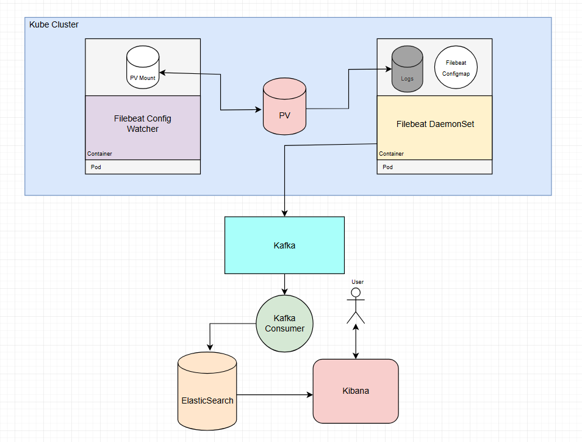
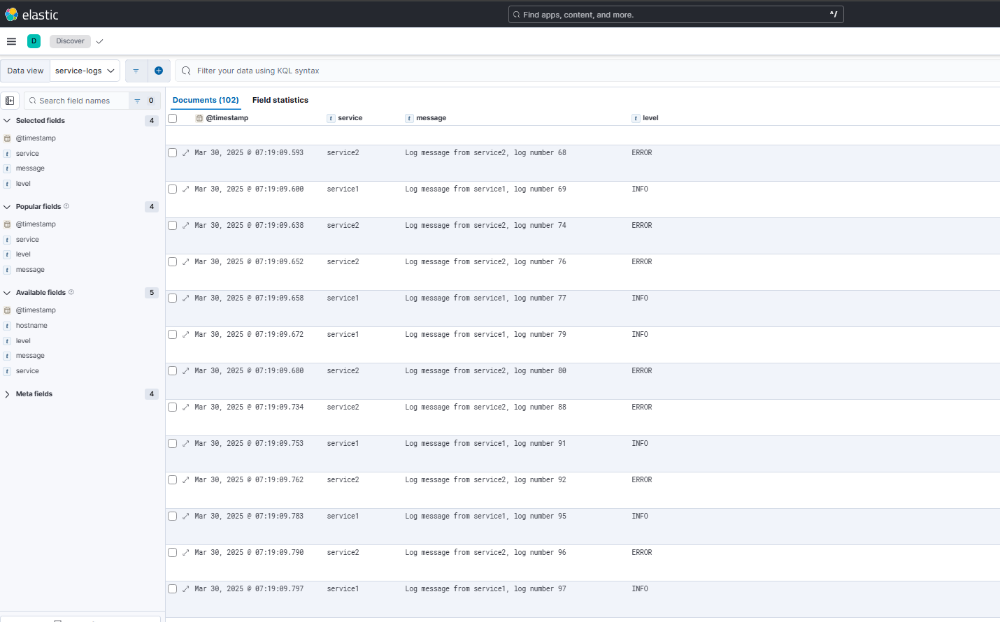

# Kubernetes Data Stream

## Architecture


## Filebeat Daemon
There is a filebeat daemon that is deployed to run on all nodes of the Kubernetes cluster. This daemonset is deployed using a standard filebeat docker image and references a configuration map `filebeat-config`
that will tell filebeat what to do with these files. One of the options filebeat output options is that it will send these files to kafka. With this implementation, we are able to perform custom parsing logic from a Kafka Consumer,
ultimately taking advantage of Kafka's high throughput and availability. 

## Service's Subscription
In order to create a service that is valid and able to be discovered by this system, you must do 2 things.
1. Ensure that your services name has a post-fix of `-service` so that the watcher knows that the event is valid and to take action on it.
2. Write your programs logs to the approriately `pvc` so that filebeat has access to it. The path in which your serivce should write is `/mnt/data/logs/{service}/*.log`
```yaml
  - name: service1
    image: service1-image
    volumeMounts:
    - name: logs
        mountPath: /mnt/data/logs
    volumes:
    - name: logs
    persistentVolumeClaim:
    claimName: logs-pvc
```

## Kubernetes Watcher
The kubernetes watcher is deployed as Python application within the cluster. This is a special watcher in which it takes advantage of the `Kubernetes` library to listen to the `kubectl events` command. Essentially, `events` in Kubernetes are important
for both troubleshooting and seeing all of the actions that are taken place in your cluster's namespace. This watcher responsibility is listen for the following events types, `ADDED`, `MODIFIED`, or `DELETED`. When one of these events are triggered,
the watcher will then check if that actions service name has the post-fix `-service`. 

If the watcher detects a valid event type and service post-fix, it will then take the apporiate action in updating the filebeats configuration map so that we can then begin dynamically routing it's files approriately. The goal with this watcher is
to avoid the need to manually update the filebeat configuration map to add the additional subscription of your new services logs to this configuration map. With this watcher, we are able to both dynamically map and route your files correctly to Kafka.

## Kafka Consumer
One of the last steps in this pipeline is the Kafka Consumer. Up to this point, you have created a service that is writing to an specific `pvc` path in which the watcher will pick up on these log files and send them to ELK.
This Kafka consumer is unique in the fact that you are able to change several configuration based on your needs and resources available. In order to have this application started, you must specific your Kafka `broker`,
and optionally specify your `topic name` and `batch size`. The batch size is important as this integer will define the amount of messages in which it will consume before sending it to ELK. 

By default, if the user does not specify a batch size, it will send messages to ELK in `1000` message batches. This interval is configurable so that depending on your log availability needs, you can change the frequeucny in which these `POST` requests
are being made.

## ELK
Once your messages have been successfully consumed from Kafka and sent to ELK, you can know visiualize your logs and messages in real time.

